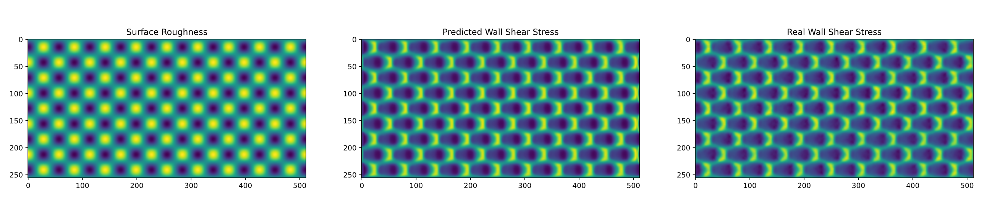

# Turbulent Egg Carton Predictions with Deep Learning

A practical introduction to python and deep learning for wall shear stress
prediction.

We will be creating a simple U-Unet using the
[Pytorch](https://pytorch.org/tutorials/) library and predicting the wall shear
stress from some surface roughness.



## Setting things up

### Python Virtual Environment

We can create a python [virtual
environment](https://docs.python.org/3/tutorial/venv.html) by typing the following
commands in the terminal. Creating a python environment allows us to quickly divide
up our development environments.

```powershell
python -m venv _env
```

In visual studio code this can be done using

```powershell
py -m venv _env
```

### Installing The Requirements

To install the requirements

```powershell
pythom -m pip install -r requirements.txt
```

All the code has been wrapped up in a quick and dirty python library called
"predictionLibs". To install the code in development mode, within the gitHub
directory run.

```powershell
pythom -m pip -e .
```

If you want to improve the overall layout and make better python packages the
following link has some good examples,
[here](https://python-packaging.readthedocs.io/en/latest/minimal.html#creating-the-scaffolding).
